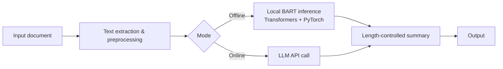

# AI-Powered Document Summarizer

A document summarization application that works in two modes: **fully offline** using a local Facebook BART model, or **online** through LLM APIs. Summary length is configurable, so the same document can be condensed into a quick overview or a more detailed digest.

Offline mode is useful when documents can't leave the machine or there is no internet access; online mode trades that for the output quality and flexibility of a hosted LLM.

## Features

- **Offline summarization** with Facebook BART, run locally through Hugging Face Transformers and PyTorch
- **Online summarization** through LLM APIs (`<!-- VERIFY: provider name(s), e.g. Gemini / OpenAI -->`)
- **Configurable summary levels** that control the required output length
- **Document processing workflow** for `<!-- VERIFY: supported input types, e.g. .txt / .pdf / .docx -->`

## How It Works



## Tech Stack

| Area | Tools |
| --- | --- |
| Language | Python |
| Offline model | Facebook BART, Hugging Face Transformers, PyTorch |
| Online model | LLM API (`<!-- VERIFY: provider -->`) |

## Getting Started

### Prerequisites

- Python 3.9+ (`<!-- VERIFY: version you developed on -->`)
- Enough disk space for the BART model weights, which download on first offline run
- An API key for the online mode (not needed for offline mode)

### Installation

```bash
git clone https://github.com/Kishanr707/summariser.git
cd summariser

python -m venv venv
source venv/bin/activate        # Windows: venv\Scripts\activate

pip install -r requirements.txt
```

### Configuration

For online mode, set your API key as an environment variable:

```bash
export LLM_API_KEY="your-key-here"   # VERIFY: use the variable name your code reads
```

Never commit API keys to the repository.

## Usage

```bash
# Offline (local BART)
python YOUR_ENTRY_FILE.py --mode offline --input path/to/document --level medium

# Online (LLM API)
python YOUR_ENTRY_FILE.py --mode online --input path/to/document --level medium
```

> Replace the file name and flags above with the ones your application actually uses.

### Summary levels

| Level | Output length | Good for |
| --- | --- | --- |
| Short | `<!-- VERIFY -->` | Quick overview |
| Medium | `<!-- VERIFY -->` | Balanced summary |
| Detailed | `<!-- VERIFY -->` | Preserving more of the source |

## Evaluation Approach

Generated summaries were reviewed manually across different document inputs against four criteria:

- **Accuracy**: does the summary state only what the source supports?
- **Relevance**: does it focus on the main points?
- **Information retention**: are key details preserved at each summary level?
- **Conciseness**: does it stay within the requested length without padding?

<!-- Once you run a quick evaluation (e.g. ROUGE on 10-15 documents), add the results table here. -->

## Limitations & Future Work

- Add automated evaluation metrics (ROUGE, BERTScore) alongside manual review
- Add a proper unit test suite and CI (GitHub Actions)
- Support chunked or hierarchical summarization for very long documents
- Add batch processing for multiple documents
- Package the app with Docker for reproducible setup
- Compare offline BART output against online LLM output side by side

## Author

**Kishan R** · [GitHub](https://github.com/Kishanr707) · [LinkedIn](https://www.linkedin.com/in/kishan-r-0799121a9/)